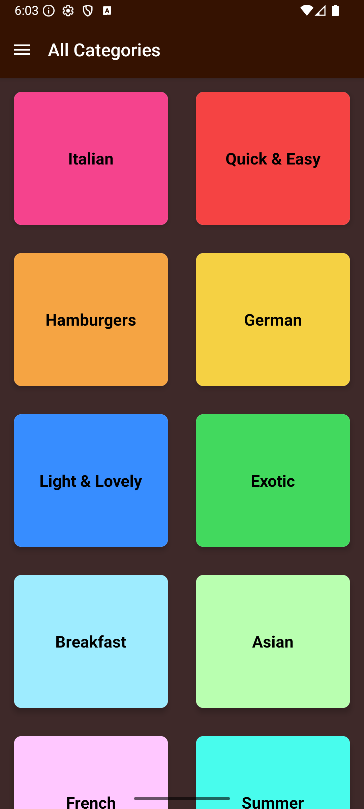
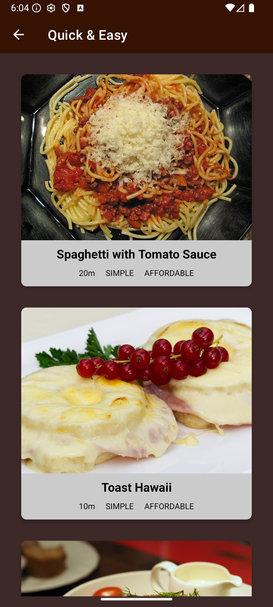
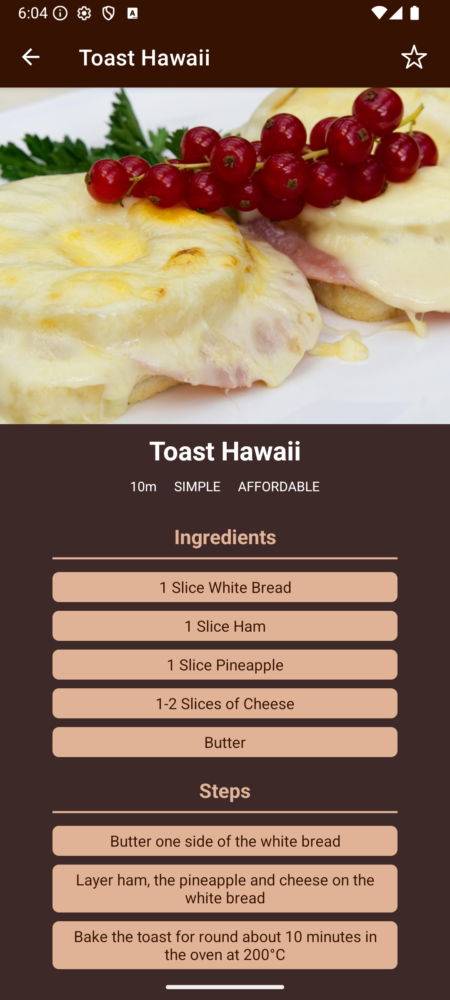
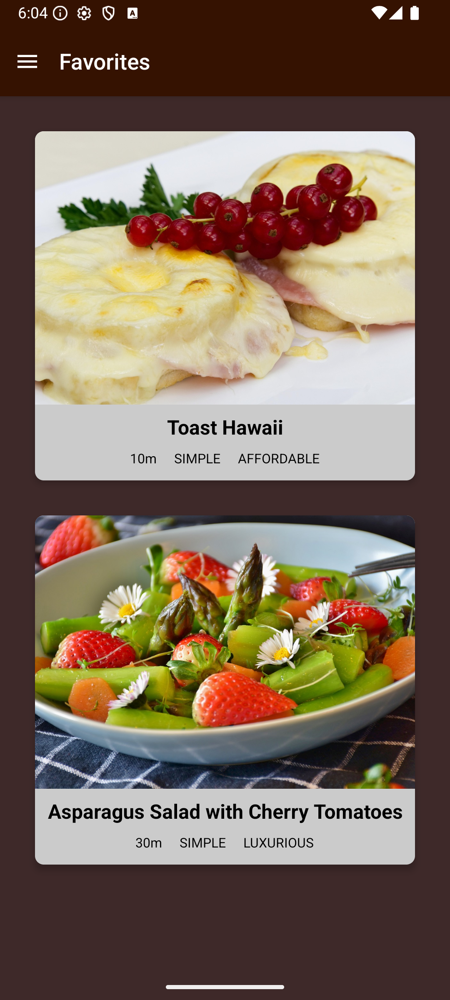

# CookSmart

CookSmart is a cross-platform mobile app built with React Native to help users discover, organize, and master recipes.

---

## 🚀 Features

- **Recipe Categories:** Explore a variety of meal categories to find recipes that suit your taste.
- **Meal Detail Page:** View detailed information for each meal, including ingredients and step-by-step cooking instructions.
- **Favorites:** Save your favorite recipes for quick and easy access anytime.

---

## 🛠️ Tech Stack

- **React Native**: Cross-platform mobile development
- **TypeScript**: Static typing for safer and scalable code
- **Context API**: State management
- **Expo**: Rapid development and deployment
- **React Navigation**: Seamless navigation between screens

---

## 📱 Screenshots

<div align="center">
  
  
  
</div>
  
</div>
  
</div>

---

## 🧑‍🍳 Getting Started

1. **Clone the repository:**

```bash
git clone https://github.com/yourusername/CookSmart.git
cd CookSmart
```

2. **Install dependencies:**

```bash
npm install
```

3. **Run the app:**

```bash
npm start
```

4. **Open in Expo Go or your emulator.**

---
## 🙏 Thanks

Thank you for checking out CookSmart! Contributions, feedback, and suggestions are always welcome.